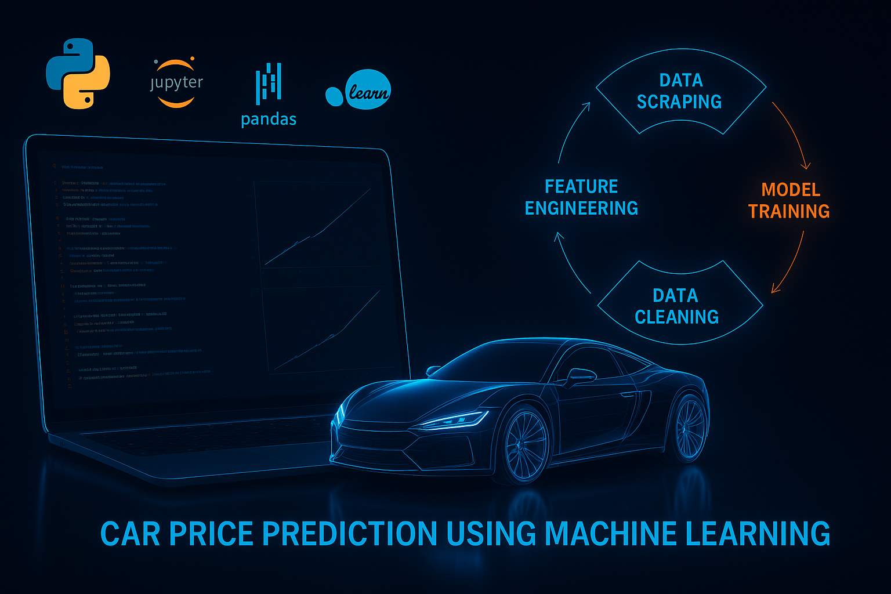
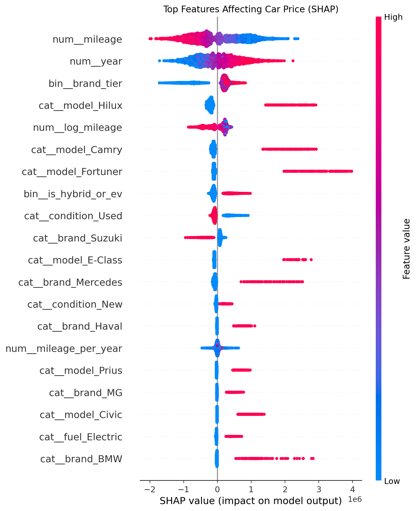

# Pakistani Car Price Predictor 2025
### Machine Learning–Based Price Prediction for New, Used, and Imported Cars in Pakistan

<div align="center">
  
</div>

<div align="center">

[](https://python.org)
[](https://lightgbm.readthedocs.io)
[](LICENSE)

</div>

---
## Why This Project Matters
Car prices in Pakistan fluctuate heavily due to currency rates, import policy changes, dealership margins, and city-wise demand differences. Buyers and sellers often rely on guesswork or outdated references.

This project introduces a **data-driven, transparent, and standardized valuation system** using real market data and machine learning.

**Key problems solved**  
- Inconsistent pricing across cities and dealers  
- Manual estimation errors  
- Lack of reliable online valuation tools  
- Difficulty comparing similar vehicles  

**Who benefits**  
- Individual buyers & sellers  
- Dealerships and showrooms  
- Students/researchers studying pricing dynamics  
- Developers building valuation APIs  

---
## Project Overview
A complete end-to-end ML pipeline that predicts current market prices with **97.48% R²** and **±218,340 PKR** average error.  
Final model: **LightGBM** with full preprocessing pipeline, deployed via Streamlit.

---
## Dataset Description
Over **5,000 real listings** scraped in 2025 from PakWheels.com and verified local dealerships (Karachi, Lahore, Islamabad, etc.).

### Raw → Cleaned → Engineered
- Removed duplicates, outliers, typos
- Standardized brand/model names and units
- Created **19 powerful features** from 9 raw columns

**Key Engineered Features**  
- Vehicle age & mileage per year  
- Log-scaled mileage  
- Brand tier (Premium / Mid-range / Budget)  
- Popular model flags (Corolla, Civic, Fortuner, etc.)  
- Hybrid/EV premium  
- Imported vs local flag  
- Automatic transmission  
- City price premium (Lahore/Karachi/Islamabad)  

---
## Repository Structure
```text
.
📁 car_price_prediction/
├── Banner.png
├── shap_summary.png
├── README.md
├── LICENSE
├── .gitignore
├── requirements.txt
├── car_price_prediction/                ← Your main project folder
│   ├── app/
│   |   └── streamlit_app.py             ← The web app
│   ├── data/
│   │   ├── raw/                         ← Original scraped data
│   │   └── processed/                   ← Cleaned + engineered CSV
│   ├── models/
│   │   ├── model.pkl
│   │   ├── preprocessor.pkl
│   │   └── feature_names.pkl
│   ├── src/                       
|   |   └── data_utils.py                ← Data cleaning file
|   |   └── feature_engineering.py       ← New Features are added in thi file
|   |   └── shap_lightgbm.py             ← This file is used to show the dominant feautures
```
---
## Model Comparison

| Rank | Model              | R² Score | MAE (PKR) | Notes                  |
|------|--------------------|----------|-----------|------------------------|
| 1    | **LightGBM**       | 0.9748   | 218,340   | Final selected model   |
| 2    | XGBoost            | 0.9735   | 229,180   | Very close second      |
| 3    | Extra Trees        | 0.9691   | 254,670   |                        |
| 4    | Random Forest      | 0.9682   | 260,450   |                        |
| 5    | Gradient Boosting  | 0.9593   | 308,910   |                        |
| 6    | Decision Tree      | 0.9217   | 478,220   |                        |
| 7    | Ridge Regression   | 0.8754   | 682,100   |                        |
| 8    | Linear Regression  | 0.8751   | 684,550   | Baseline               |

---
## Feature Importance (SHAP Analysis)

<div align="center">
  
</div>

**Dominant Features:** Mileage → Year → Brand Tier → Model → Hybrid/EV → Transmission → City

---
## Future Improvements

- Integrate more data sources (OLX, local dealers API)
- Add time-series trend analysis
- Build REST API endpoint
- Compare with deep learning models (TabNet / Neural Networks)

---
## Run Locally
```bash
git clone https://github.com/harisyar-ai/pakistani-car-price-predictor.git
cd pakistani-car-price-predictor
pip install -r requirements.txt
streamlit run car_price_prediction/app/streamlit_app.py
```
---
  ## Live Web Application
**Deployment in progress**  
Expected URL: [https://pakistani-car-price-predictor.streamlit.app](https://pakistani-car-price-predictor.streamlit.app)


---

                                          December 2025
                               Developed by Muhammad Haris Afridi
                            Stars & feedback are highly appreciated ⭐
  
    github.com/harisyar-ai
