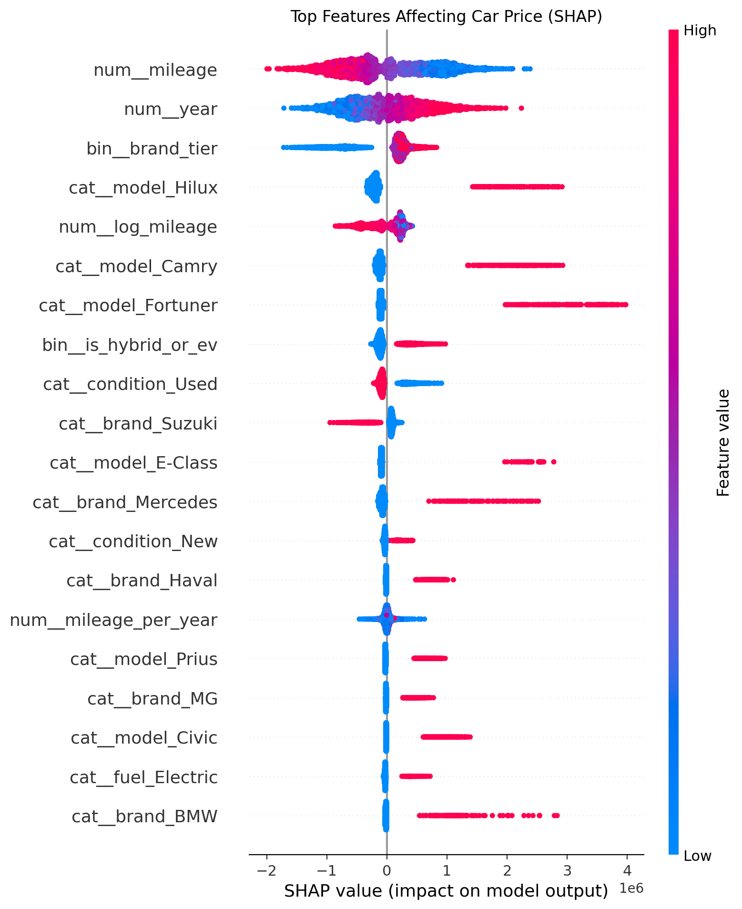

# Pakistani Used Car Price Predictor
### Domain-Specific Feature Engineering and Explainable Machine Learning for Used Vehicle Valuation in Pakistan

<div align="center">
  
</div>

<div align="center">

[](https://python.org)
[](https://lightgbm.readthedocs.io)
[](https://shap.readthedocs.io)
[](LICENSE)

</div>

---

## Project Overview
An end-to-end machine learning pipeline for predicting used car prices in Pakistan using real PakWheels listings.  
Final model: **LightGBM** — Test R² = **0.9676**, RMSE = **0.1416**, MAE = **0.0899** (log-price scale).  
Explainability provided via **SHAP**, deployed as a Streamlit web app.

> This project is the implementation companion to the research paper:  
> *"Domain-Specific Feature Engineering and Explainable Machine Learning for Used Vehicle Valuation in Pakistan"*  
> Submitted to the **International Journal of Data Science and Analytics (IJDSA), Springer**.

---

## Live Web App

<div style="padding:10px; font-size:100%; text-align:left;">
    URL: 
    <a href="https://pakistani-car-price-predictor.streamlit.app/" target="_blank">
        Click here for Car Price Prediction
    </a>
</div>

---

## Why This Project Matters
Car prices in Pakistan are highly volatile — driven by currency fluctuations, import policy changes, dealership margins, and city-level demand disparities. Buyers and sellers typically rely on guesswork or outdated references, with no standardized valuation system available.

This project introduces a **data-driven, transparent, and explainable valuation pipeline** built on real market data from PakWheels.com.

**Key problems addressed**
- Inconsistent pricing across cities and dealers
- Absence of reliable, data-backed online valuation tools
- Lack of explainability in price estimates
- Difficulty in comparing vehicles with similar specifications

**Who benefits**
- Individual buyers and sellers
- Dealerships and showrooms
- Automotive finance and insurance sectors
- Researchers studying used vehicle markets in emerging economies

---

## Dataset

**Source:** PakWheels.com — Pakistan's largest used car marketplace  
**Raw listings collected:** ~75,000  
**After preprocessing and 200 Lac price cap:** ~58,750 listings  

### Pipeline: Raw → Cleaned → Engineered

- Removed duplicates, inconsistent entries, and implausible records
- Applied a 200 Lac price cap to exclude ultra-luxury outliers that skew model performance
- Standardized brand/model naming conventions
- Engineered domain-specific features from raw columns

**Key Engineered Features**
- `car_age` — derived from model year relative to listing year
- `brand_origin` — brand grouped by country/region of manufacture
- `city_tier` — city-level demand classification
- `trim_tier_s4` — trim-level tier (4-level scale)
- `trim_grade_s4` — fine-grained trim quality score
- `is_electric` — EV/hybrid flag

---

## Repository Structure

```text
📁 car_price_prediction/
├── Banner.png
├── shap_summary.png
├── README.md
├── LICENSE
├── .gitignore
├── requirements.txt
├── car_price_prediction/                ← Main project folder
│   ├── app/
│   |   └── streamlit_app.py             ← Streamlit web app
│   ├── data/
│   │   ├── raw/                         ← Original scraped listings
│   │   └── processed/                   ← Cleaned + engineered CSV
│   ├── models/
│   │   ├── model.pkl
│   │   ├── preprocessor.pkl
│   │   └── feature_names.pkl
│   ├── src/
│   |   └── data_utils.py                ← Data cleaning utilities
│   |   └── feature_engineering.py       ← Feature construction
│   |   └── shap_lightgbm.py             ← SHAP explainability
```

---

## Model Comparison

13 models were trained and evaluated. Top results (log-Lac scale):

13 models were trained and evaluated (log-price scale, sorted by Test RMSE):

| Rank | Model               | Train RMSE | Test RMSE | Test MAE | Test R²  | Notes                |
|------|---------------------|------------|-----------|----------|----------|----------------------|
| 1    | **LightGBM**        | 0.1188     | 0.1416    | 0.0899   | 0.9676   | Final selected model |
| 2    | XGBoost             | 0.1276     | 0.1430    | 0.0926   | 0.9669   |                      |
| 3    | Random Forest       | 0.1091     | 0.1450    | 0.0914   | 0.9660   |                      |
| 4    | Extra Trees         | 0.1135     | 0.1454    | 0.0908   | 0.9658   |                      |
| 5    | Bagging*            | 0.0623     | 0.1508    | 0.0952   | 0.9633   | *Low train RMSE indicates overfitting |
| 6    | CatBoost            | 0.1469     | 0.1515    | 0.0993   | 0.9629   |                      |
| 7    | Gradient Boosting   | 0.1662     | 0.1683    | 0.1139   | 0.9542   |                      |
| 8    | Ridge               | 0.1791     | 0.1802    | 0.1177   | 0.9475   |                      |
| 9    | Linear Regression   | 0.1791     | 0.1802    | 0.1177   | 0.9475   |                      |
| 10   | KNN                 | 0.1595     | 0.1816    | 0.1121   | 0.9467   |                      |
| 11   | Decision Tree       | 0.1956     | 0.2054    | 0.1323   | 0.9318   |                      |
| 12   | Lasso               | 0.2279     | 0.2285    | 0.1537   | 0.9156   |                      |
| 13   | AdaBoost            | 0.2637     | 0.2651    | 0.1959   | 0.8864   | Weakest performer    |

---

## Feature Importance (SHAP Analysis)

<div align="center">
  
</div>

SHAP values were used to explain individual predictions and quantify global feature contributions. The model is fully interpretable — each prediction can be traced back to its driving features.

---

## Future Improvements

- Extend dataset with additional sources (OLX, local dealer listings)
- Add time-series trend analysis for price forecasting
- Build a REST API endpoint for third-party integrations
- Explore deep learning baselines (TabNet, Neural Networks)
- Generalize to new/imported vehicle segments

---

## Run Locally

```bash
git clone https://github.com/harisyar-ai/pakistani-car-price-predictor.git
cd pakistani-car-price-predictor
pip install -r requirements.txt
streamlit run car_price_prediction/app/streamlit_app.py
```

---

## Authors

**Muhammad Haris Afridi** (First Author / Corresponding)  
BS Artificial Intelligence, University of Agriculture Peshawar  
Research Assistant, Digital Image Processing Lab, Islamia College Peshawar  
[github.com/harisyar-ai](https://github.com/harisyar-ai) · [linkedin.com/in/harisyar-ai](https://linkedin.com/in/harisyar-ai)

**Zoraiz Elya** — Sejong University  
**Muhammad Mohsin** — University of Lahore

---

*Submitted to IJDSA (International Journal of Data Science and Analytics), Springer · 2025*
